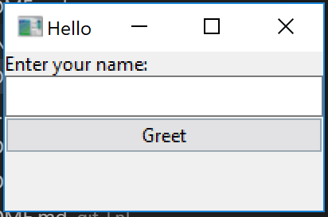

# Playing with a Go wrapper of libui

## Summary

The ui package from andlabs is a cross platform native widget wrapper that provides one of the slimmest compilations of a GUI application in Go. The hello world app below is a single file static linked application that takes up only 7.4MB on my machine when compiled with Go 1.8.3 and gcc version 7.1.0 (x86_64-posix-seh-rev0, Built by MinGW-W64 project) under Windows 10.

The licensing is also very permissive, making this a fantastic choice for any sort of simple project. If you need more widgets and richer features, or a faster development cycle, you could get great licensing from wxWidgets or a huge feature set with QT, but at the cost of a more complex compilation that results in an application an order of magnitude larger.



## Install

You need to have GCC installed and in your path (compiled with SEH style exceptions). Old versions don't work. I'm not certain what the cutoff would be but on Windows I had issues with 5.10 TDM and [someone couldn't get GCC 5.4 via Cygwin to work](https://github.com/andlabs/ui/issues/196). 

```
go get github.com/andlabs/ui
go build -ldflags -H=windowsgui
```

The linking flag hides the terminal Window.

## Known Issues

The author is aware of the issue with the [enter key closing the application](https://github.com/andlabs/ui/issues/239) when a textbox is focused.

There are several features and fixes that are ready in libui (the C base library) but not ready in package ui (the Go wrapper) because the author is only going to base ui releases on binary releases of libui. If you look at libui, the current work is being done in non-master branches on a new method of font rendering and a table widget which includes functionality for a treeview.

[&#x2190; Back to Project List](../README.md)