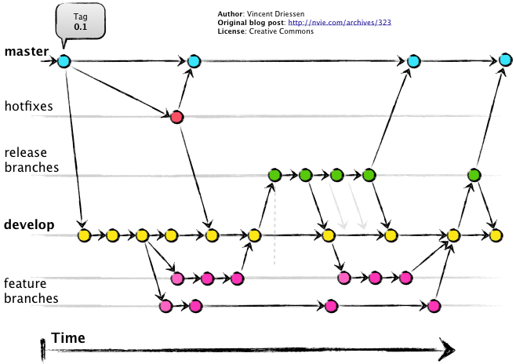

# Git Lunch and Learn

[Official Tutorial](https://git-scm.com/docs/gittutorial)

 -	Overview of Git approach as compared to TFS
    - TFS is centralized (SQL Server, TFS Server, Collections, Projects)
    - Easy merges / No "Abandon Ship Procedure"
    - Git is decentralized

      
 -	Behind the scenes: What’s happening??
    - Commits are just diffs
      
 -	Tools
    -	Commandline
    - SourceTree
    -	VS Code
    -	Visual Studio
 -	Tips and Tricks: How do I fix it when I … ?
    - First things first:
    ```
    git config --global user.name "Dan Wolf"
    git config --global user.email dcwolf@gmail.com
    git config --global credential.helper wincred
    ```
    - `.gitignore` and `.gitkeep`
    - Remove ignored files from cache (another term for stage or index)
    ```
    foreach ($i in iex 'git ls-files -i --exclude-from=.gitignore') { git rm --cached $i }
    ```
    - Revert (before push)
    ```
    git reset --hard <SOME-COMMIT, e.g. ~HEAD>
    ```
    - Or, if you only want to add changes to previous commit, you could do a `git reset --soft HEAD~` which will undo the previous commit but leave your changes staged.

    - If you already pushed, use `git revert HEAD` to create an "undo" commit. This will prevent other repos from getting mixed up. **HEAD** is simply the easy (non-SHA) name for your last commit.