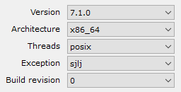

# Install GCC

There are a few options on Windows: [Mingw (32 bit only)](https://sourceforge.net/projects/mingw/files/latest/download?source=files), MinGW-w64 (either 32 or 64 bit, see directions below), MSys, 

1. Download the web installer for MinGW-w64: https://sourceforge.net/projects/mingw-w64/ 

    Options [(explained)](https://stackoverflow.com/questions/29947302/meaning-of-options-in-mingw-w64-installer):

    

2. Select a location to install. I used the default. For these settings it recommended `C:\Program Files\mingw-w64\x86_64-7.1.0-posix-sjlj-rt_v5-rev0`

3. Add the GCC bin folder to your system path. This will confuse any applications requiring 32 bit GCC, so if this applies to you, don't add it to path and instead modify your gcc environmental variable to point here. My bin folder was right here: `C:\Program Files\mingw-w64\x86_64-7.1.0-posix-sjlj-rt_v5-rev0\mingw64\bin`

4. In the Windows start bar, type `system var` and select to edit the environmental variables. The "Advanced" tab of the "System Properties" dialog should appear.

5. Click the button near the bottom titled "Environmental Variables".

6. To make it available to all users, click the "Edit..." button after selecting Path under the "System variables" control group. (If you only want GCC added to path for yourself, edit the Path under "User variables" instead.)

7. If your terminal (Powershell, CMD, or an integrated terminal in your IDE) was already open, you'll need to close and re-open it to get your new environmental variables loaded.

8. Fetch and install Pixel and all dependencies:

```
go get -u github.com/go-gl/glfw/v3.2/glfw
go get -u github.com/palumacil/misc/pixgame...
```