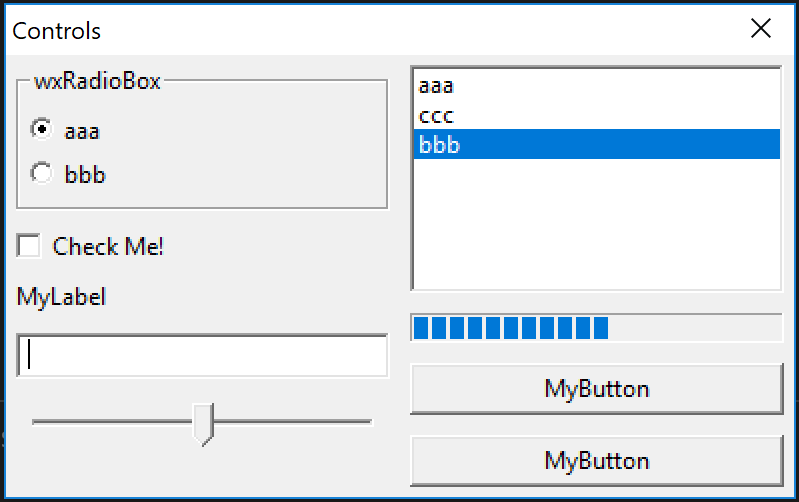

# WxGo Example

## Summary

I'm currently unable to build with ```go get github.com/dontpanic92/wxGo/wx```. I filed [issues](https://github.com/dontpanic92/wxGo/issues/27) and to ask for help on this. If I unzip a pre-built binary into my GOPATH from a release download, it works fine. The project maintainer seems very helpful and responsive.

The example below here the controls example from the wxGo project.

## Build

```
go build
.\wxEg
```



## License Notes

The examples, the Go wrapper, and wxWidgets seem to be a mix of a permissive wxWindows license (similar to LGPL) and LGPL, which basically means you can use the code with other components of any other license if you link dynamically. I've included the license from the wxGo project in this folder. wxWidgets says:
 
"The wxWindows Library Licence is essentially the L-GPL (Library General Public Licence), with an exception stating that derived works in binary form may be distributed on the user's own terms. This is a solution that satisfies those who wish to produce GPL'ed software using wxWidgets, and also those producing proprietary software."

 I recommend you visit the [wxWidgets license page](https://www.wxwidgets.org/about/licence/) to get a good understanding of the license. Overall, I believe this GUI framework has one of the best licenses out of all major GUI frameworks. I hope you enjoy using it too, and if you have license questions, ask the official wxWidgets team. They're fantastic people.

[&#x2190; Back to Project List](../README.md)